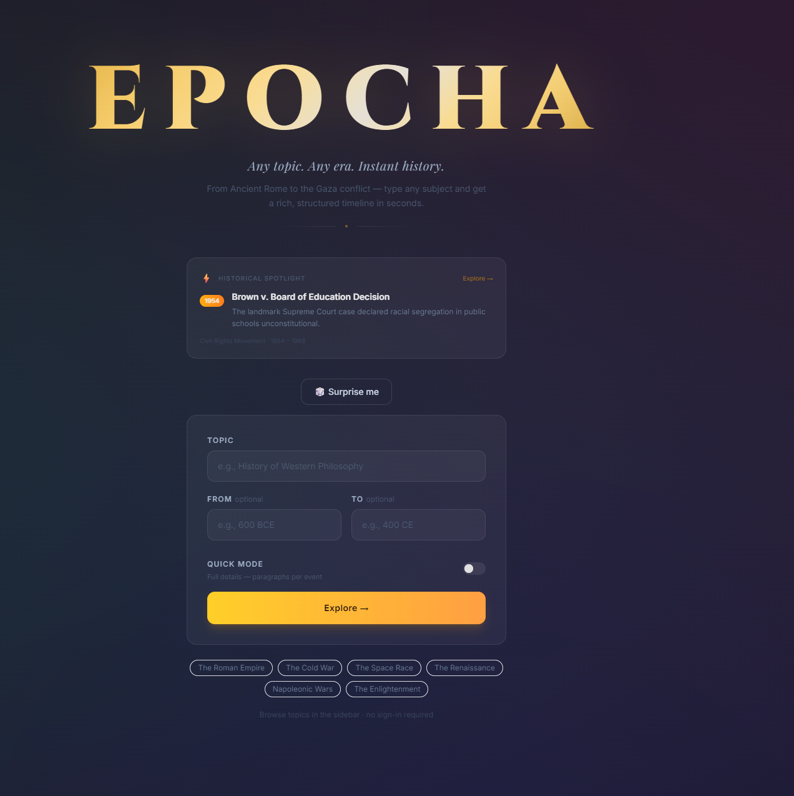
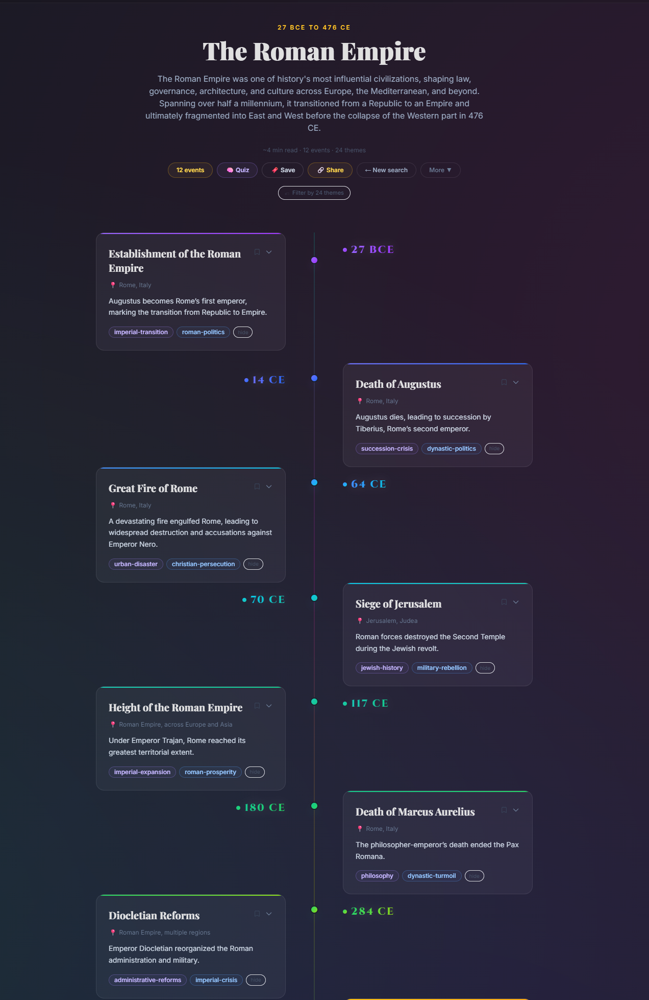
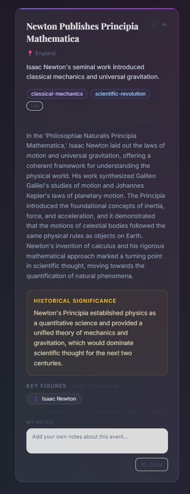
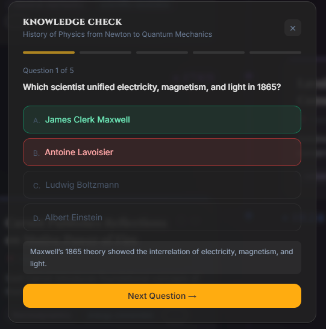

# Epocha

An AI-powered historical timeline generator. Enter any topic and time period and get a rich, structured timeline — events, key figures, significance, and quiz questions — streamed in real time and cached for instant repeat access.

**Live:** https://epochas.app

**Landing page:** https://arjunjm.github.io/epocha/



---

## Features

### Core
- **Timeline generation** — any topic, any era; 12 events streamed progressively via SSE
- **Quick mode** — toggle off detailed paragraphs for ~2× faster generation
- **Pre-flight cache check** — authenticated searches hit the cache before opening SSE; cached topics load instantly
- **100+ curated topics** — sidebar taxonomy across 8 categories, pre-generated and served from Redis
- **Public browse** — sidebar and trending topics load without sign-in

### Learning tools
- **Quiz** — 12 MCQs generated per timeline, 5 served per session with XP rewards
- **Flashcard mode** — reveal events one by one, score yourself
- **Time Machine** — fullscreen immersive event slideshow
- **Learning Paths** — 5 curated sequences with per-step checkmarks and localStorage progress

### Discovery
- **Trending topics** — up to 15 current events shown in sidebar; sourced via pluggable news providers (RSS feeds or LLM)
- **News providers** — admin can select trending topic source: LLM (default, nightly), RSS feeds (BBC World · Al Jazeera · NPR, no API key needed)
- **Discover page** — visual grid of all built-in topics with search and category filter
- **Historical Spotlight** — random event from a cached timeline on the home screen
- **Related topics** — 4–5 related topics at the bottom of every timeline; pre-warmed in background
- **Next era** — "Keep the story going" button chains consecutive eras seamlessly
- **Surprise me** — loads a random cached topic instantly

### Analysis
- **Key Figure Explorer** — click any figure to filter the timeline to their events
- **Insights panel** — events by century, top figures, themes, locations
- **Density heatmap** — visualise event distribution across eras
- **In-timeline search** — live keyword filter across title, summary, significance, figures, location
- **Tag filter** — multi-select theme filter

### Personalisation & stats
- **Stats page** — dedicated page showing quiz history (score, XP, date — persisted in Cosmos DB), completed topics, and recently explored timelines
- **Gamification** — 20 levels, XP system, 8 achievement badges, Steam-style showcase
- **Bookmarks** — save individual events across sessions
- **Collections** — save full timelines to named collections (Cosmos DB)
- **Personal notes** — per-event text annotations in localStorage
- **Reading progress** — marks events as read with a progress bar
- **5 visual themes** — Midnight, Sepia, Neon, Ocean, Forest
- **Light/dark mode** — nav bar toggle, no login required

### Sharing & export
- **Share modal** — copyable link, pre-written tweet, X and LinkedIn buttons, "Generated on Epocha" attribution
- **Shareable URLs** — topic/start/end encoded in query params with dynamic OG meta tags
- **Export** — PDF (print), Markdown, self-contained HTML

### Compare & citations
- **Parallel compare mode** — "⟺ Compare" button loads a second timeline side-by-side with a shared time axis; desktop two-column split, mobile tab switcher; overlap period highlighted in the axis bar
- **Source citations** — each event card links to its Wikipedia article (Claude returns a specific URL per event); shown in expanded event view

### UX
- **Welcome modal** — first-visit intro for new users
- **Generation timer** — elapsed time and estimated remaining shown during streaming
- **Retry button** — error screen re-runs the exact failed request
- **PWA** — installable, offline-resilient
- **Keyboard shortcuts** — Q (quiz), B (bookmark), C (compact), H (home), ? (help)

---

## Screenshots

| | |
|---|---|
|  |  |
| *Home — search any topic or browse the sidebar* | *Timeline — streamed events with progressive detail* |
|  |  |
| *Event card — expanded with significance, figures, notes* | *Quiz — 5 MCQs with XP rewards* |

---

## Architecture

```
┌─────────────────────────────────────────────────────────────────┐
│                        Client (React/Vite)                       │
│  Sidebar · Timeline · Quiz · Flashcards · Insights · Stats · Admin │
└───────────────────────┬─────────────────────────────────────────┘
                        │  HTTPS + SSE streaming
┌───────────────────────▼─────────────────────────────────────────┐
│                   Express Server (Node.js)                        │
│  Auth (Google OAuth) · Rate limiting · XP/Gamification           │
│  REST API + SSE streaming · Search analytics logging             │
└──────┬──────────────────┬──────────────────────┬────────────────┘
       │                  │                       │
┌──────▼──────┐  ┌────────▼────────┐  ┌──────────▼─────────────┐
│  Anthropic  │  │   Azure Cosmos  │  │  Azure Cache for Redis  │
│  claude-    │  │   DB (NoSQL)    │  │  timeline cache (7d)    │
│  haiku-4.5  │  │  users · saved  │  │  quiz cache             │
│             │  │  timelines      │  │  search analytics       │
│  Azure      │  │  quiz results   │  │  trending topics        │
│  OpenAI     │  └─────────────────┘  │  topic embeddings       │
│  (embed +   │                       └──────────┬─────────────┘
│  GPT-4o)    │
└─────────────┘
                                                  │ enqueue related topics
                                       ┌──────────▼─────────────┐
                                       │  Azure Storage Queue    │
                                       │  epocha-pregenerate-    │
                                       │  jobs                   │
                                       └──────────┬─────────────┘
                                                  │ dequeue (every 10s)
┌─────────────────────────────────────────────────▼───────────────┐
│              Azure Function App (Node.js, Consumption)           │
│  processPregenQueue  timer */10s — parallel batch of 10 topics   │
│  pregenerateManual   HTTP — enqueue full topic catalog           │
│  generateTrendingEvents HTTP — LLM current events → enqueue     │
│  pregenerateTimelines   timer 2AM UTC — nightly full queue       │
└─────────────────────────────────────────────────────────────────┘
```

---

## Tech Stack

| Layer | Technology |
|-------|-----------|
| Frontend | React 18, Vite, TypeScript, Tailwind CSS |
| Backend | Node.js 22, Express, TypeScript |
| LLM | Azure OpenAI `gpt-4o` (production) — switchable to Anthropic `claude-haiku-4-5` |
| Embeddings | Azure OpenAI `text-embedding-3-small` — semantic topic name matching |
| Auth | Google OAuth 2.0, JWT cookies, Passport.js |
| Database | Azure Cosmos DB (NoSQL, serverless) |
| Cache | Azure Cache for Redis (C0, 7-day TTL) |
| Queue | Azure Storage Queue (`epocha-pregenerate-jobs`) |
| Background jobs | Azure Functions v4 (Linux Consumption Plan) |
| Infrastructure | Azure App Service B1 (Linux), Azure Key Vault |
| CI/CD | GitHub Actions → Azure App Service + Azure Functions |

---

## LLM Provider

The app abstracts the LLM provider via `server/src/llm.ts`. Switch by setting a Key Vault secret:

```
llm-provider = azure-openai   # production default — gpt-4o
llm-provider = anthropic      # alternative — claude-haiku-4-5
```

Azure OpenAI requires: `azure-openai-endpoint`, `azure-openai-key`, `azure-openai-deployment`.

**Embeddings** always use Azure OpenAI (`text-embedding-3-small`) regardless of the LLM provider setting. Requires `azure-openai-embedding-deployment` in Key Vault.

---

## Caching Strategy

Timeline responses are cached in Redis with a 7-day TTL:

```
timeline:<normalised-topic>:<startYear>:<endYear>
```

**Cache layers:**
- `GET /api/timeline/browse` — public, cache-only, no auth, no rate limit
- `POST /api/timeline` — checks cache first (pre-flight in client before SSE); LLM only on miss; lite mode results are not cached
- On every timeline serve — server fire-and-forgets an enqueue of related topics and the next era to the Azure Storage Queue
- Nightly Azure Function — pre-generates and caches the full topic catalog via the queue
- `epocha:trending-topics` — recently generated topics for the Trending sidebar section
- `epocha:popular-topics` — search frequency per topic, used for demand-driven pre-caching
- `epocha:analytics:searches` — search event log (2000 entries, 7-day window) for admin analytics
- `epocha:topic-embeddings` — Redis hash of topic name embeddings for semantic cache matching; backfilled on every cache hit

---

## Azure Function Queue

The pre-generation pipeline uses a queue-based fan-out:

1. **Producer** (HTTP or timer trigger) enqueues topic jobs to `epocha-pregenerate-jobs`
2. **Consumer** (`processPregenQueue`, timer every 10s) dequeues batches of 10, processes in parallel with `Promise.allSettled`
3. Failed jobs are retried after 30s (explicit `updateMessage` visibility timeout)
4. Azure blob lease prevents overlapping timer invocations

Nightly queue phases (2AM UTC):
1. Trending current events — LLM asked for 10 significant contemporary events
2. Popular searches — top 30 from `epocha:popular-topics` + their related topics
3. AI-suggested — 15 historically interesting topics from the LLM
4. Sidebar defaults — all ~40 taxonomy topics kept fresh

**Trending news providers** — the manual `generateTrendingEvents` trigger in the admin page supports three sources:

| Provider | Source | Notes |
|----------|--------|-------|
| LLM (default) | GPT-4o training knowledge | Used by nightly timer |
| RSS Feeds | BBC World · Al Jazeera · NPR | No API key needed; headlines distilled by LLM |
| The Guardian | Guardian Open Platform API | Requires `guardian-api-key` in Key Vault |

---

## Local Development

**Prerequisites:** Node.js 18+, an Anthropic API key

```bash
# Install all dependencies
npm install
cd server && npm install
cd ../client && npm install
cd ../functions && npm install

# Server env (server/.env)
ANTHROPIC_API_KEY=sk-ant-...

# Run dev servers (client :5173, server :3001)
npm run dev
```

Open http://localhost:5173. The server falls back to in-memory cache when no `REDIS_URL` is set.

**Switching to Azure OpenAI locally:**
```bash
# server/.env
LLM_PROVIDER=azure-openai
AZURE_OPENAI_ENDPOINT=https://your-resource.openai.azure.com/
AZURE_OPENAI_KEY=your-key
AZURE_OPENAI_DEPLOYMENT=gpt-4o
```

---

## Deployment

Deployments trigger automatically on push to `master` via GitHub Actions:

1. **Test** — `vitest run` for server and client
2. **Build** — `tsc -b && vite build` (client), `tsc` (server), `tsc` (functions)
3. **Deploy App Service** — zip deploy to Azure App Service
4. **Deploy Functions** — zip `dist/` + `node_modules/` → blob storage → `WEBSITE_RUN_FROM_PACKAGE`
5. **Smoke tests** — run against live app after deploy; auto-rollback if >20% fail
6. **Mark stable** — stores successful run ID for rollback reference
7. **GitHub Pages** — `pages.yml` auto-triggers via `workflow_run` after a successful deploy, publishing `docs/index.html` to https://arjunjm.github.io/epocha/

**Required GitHub secrets:** `AZURE_WEBAPP_PUBLISH_PROFILE`, `AZURE_CLIENT_ID`, `AZURE_CLIENT_SECRET`, `AZURE_TENANT_ID`, `AZURE_SUBSCRIPTION_ID`, `AZURE_STORAGE_KEY`

**Key Vault secrets:**
```
anthropic-api-key                  llm-provider
azure-openai-endpoint              azure-openai-key
azure-openai-deployment            azure-openai-embedding-deployment
google-client-id                   google-client-secret
google-callback-url                jwt-secret
cosmos-endpoint                    cosmos-key
redis-url                          storage-connection-string
guardian-api-key                   (optional — Guardian RSS provider)
```

---

## Project Structure

```
/
├── client/          React/Vite frontend
│   └── src/
│       ├── components/   UI components (Timeline, EventCard, Sidebar, Admin, ...)
│       ├── hooks/        Custom hooks (useAuth, useBookmarks, useReadProgress, ...)
│       ├── data/         Topic taxonomy, learning paths
│       └── utils/        Toast emitter
├── server/          Express backend
│   └── src/
│       ├── index.ts      Routes, SSE streaming, analytics logging
│       ├── llm.ts        LLM provider abstraction (Anthropic / Azure OpenAI)
│       ├── cache.ts      Redis + in-memory cache, analytics, trending, embeddings
│       ├── embeddings.ts Azure OpenAI text-embedding-3-small, cosine similarity, semantic match
│       ├── queue.ts      Azure Storage Queue producer (enqueueRelatedTopics)
│       ├── userStore.ts  Cosmos DB — users, XP, saves, themes, quiz results
│       ├── quiz.ts       Quiz question generation
│       └── auth.ts       Google OAuth + JWT
├── functions/       Azure Functions — queue consumer + producers
│   └── src/
│       ├── generateSingle.ts      Timer consumer (processPregenQueue, every 10s)
│       ├── newsProviders.ts       Trending topic sources (LLM, RSS, Guardian)
│       └── pregenerateTrigger.ts  HTTP + timer producers
├── tests/smoke/     Post-deploy smoke tests (Vitest)
└── infra/           Bicep IaC (Key Vault, App Service, Cosmos, Redis, Queue, Functions)
```
